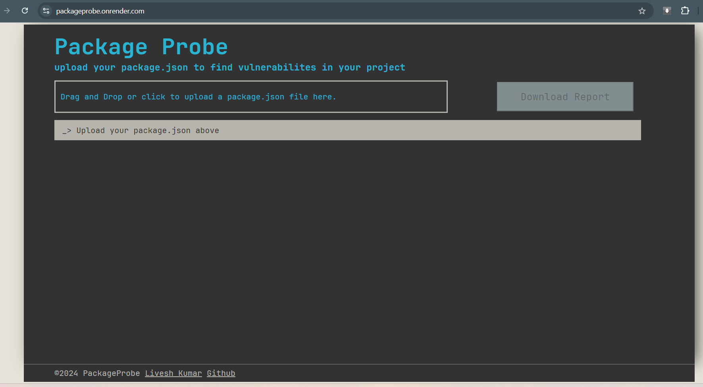
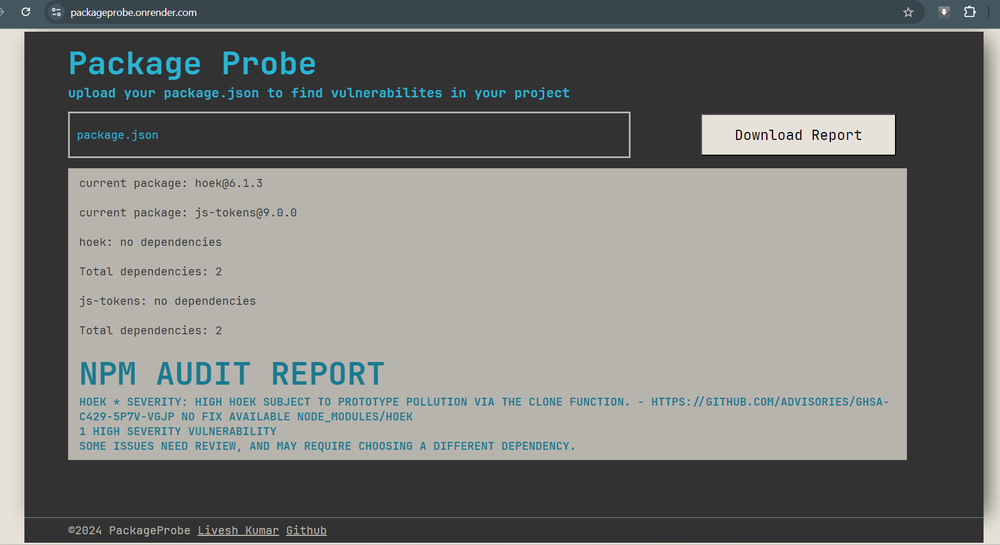
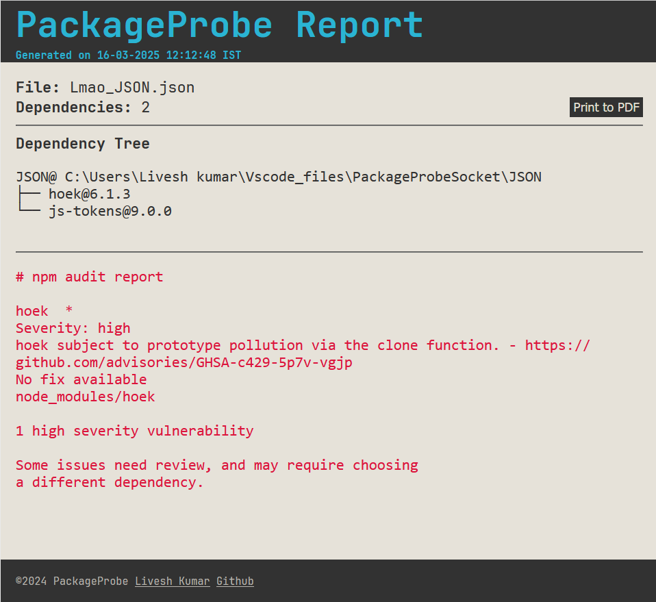
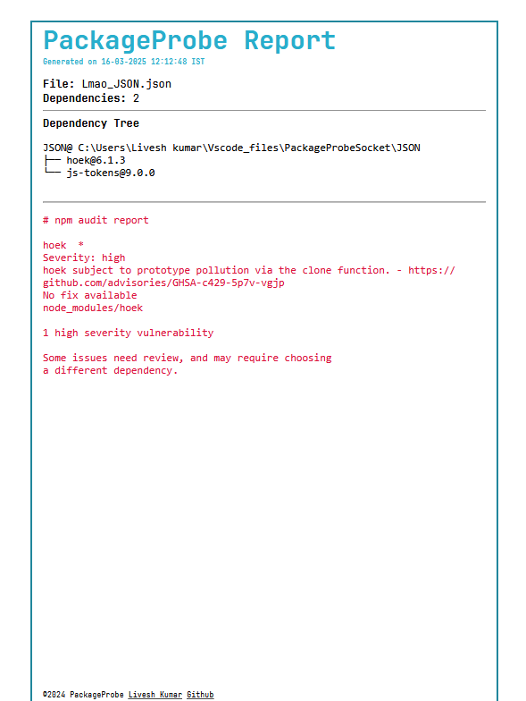

# PackageProbe

[](https://npmjs.com)
[](https://expressjs.com)
[](https://render.com)

PackageProbe is a web application that helps developers analyze the dependencies of their NPM projects. Users can easily upload their `package.json` file, view all dependencies and sub-dependencies, and check for vulnerabilities in the entire dependency tree. The application generates a comprehensive report that can be viewed online and downloaded for offline use.

## Features

- **Drag and Drop or Upload**: Users can drag and drop or upload their `package.json` file.
- **Dependency Analysis**: Automatically detects all dependencies and sub-dependencies.
- **Vulnerability Check**: Scans the entire dependency tree and sub depencencies for known vulnerabilities.
- **Real-time Display**: Shows dependencies and vulnerabilities to the user in real-time.
- **Report Generation**: Creates a detailed report of the dependencies and vulnerabilities.
- **Downloadable Report**: Users can download the generated report in PDF/HTML version for offline reference.

## Technologies Used

- **Backend**: Express.js, Cheerio
- **Frontend**: JavaScript, WebSockets, CSS, HTML
- **Hosting**: Render platform

## Getting Started

### Prerequisites

- Node.js
- NPM (Node Package Manager)

### Installation

1. Clone the repository:

    ```bash
    git clone https://github.com/dev-osiris/PackageProbe.git
    cd packageprobe
    ```

2. Install dependencies:

    ```bash
    npm install
    ```

3. Start the application:

    ```bash
    npm start
    ```

4. Open your browser and go to `http://localhost:3000`.

## Usage

1. **Upload `package.json` File**:
   - Drag and drop or use the file upload button to upload your NPM project's `package.json` file.

2. **View Dependencies**:
   - The website will automatically parse the `package.json` file, find all dependencies and sub-dependencies, and display them in real-time.

3. **Check Vulnerabilities**:
   - The application will check for known vulnerabilities in the entire dependency tree and display the results.

4. **Generate and Download Report**:
   - A comprehensive report will be generated and displayed to the user. The report can be downloaded as HTML/PDF for offline reference.

## Screenshots


*Landing Page*  
<br>


*Upload your `package.json` file.*  
<br>


*Download and view the generated report.*
<br>


*The report can be printed as PDF version.*

## Deployment

This project is deployed on [Render](https://packageprobe.onrender.com/).

[](https://packageprobe.onrender.com/)

## Contributing

We welcome contributions to improve PackageProbe. To contribute:

1. Fork the repository.
2. Create a new branch (`git checkout -b feature-branch`).
3. Make your changes.
4. Commit your changes (`git commit -m 'Add new feature'`).
5. Push to the branch (`git push origin feature-branch`).
6. Open a pull request.

## License

This project is licensed under the GNU GPLv3 - see the [LICENSE](/LICENSE) file for details.

## Contact

For any questions or suggestions, please open an issue or contact [Livesh Kumar](mailto:liveshkumar123@gmail.com).
